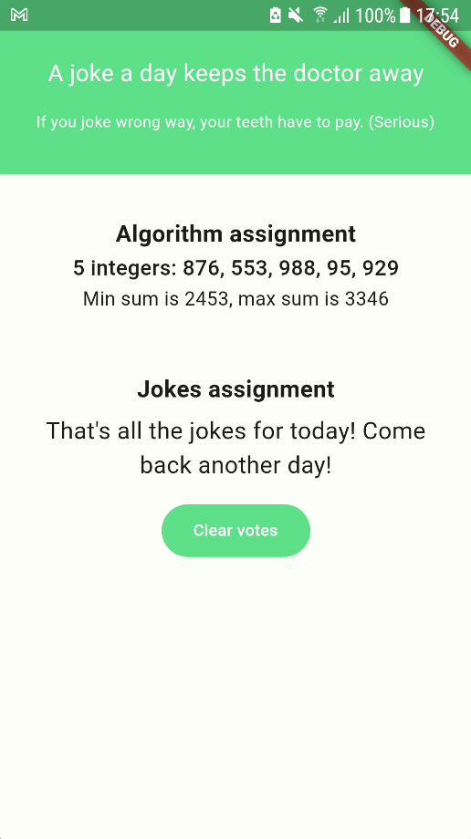

# zens_first_test
A repository which stores the implementation of the requirements in the given intern first test of ZenS
The UI will have 2 main parts:
1. Display a list of 5 integers and the result of sum min and sum max of 4 of those integers
2. I solve the algorithm assignment by doing:
   2.1 Generate list of 5 integers each time user changes the vote state
   2.2 Sort the list
   2.3 Min sum is the sum of 4 min integers and max sum is the sum of 4 max integer 
   in the sorted list
3. Display a joke and 2 buttons to vote and down-vote for the joke
4. I used BLoC to manage the state of the app
5. Product's images:
    - 
    - 