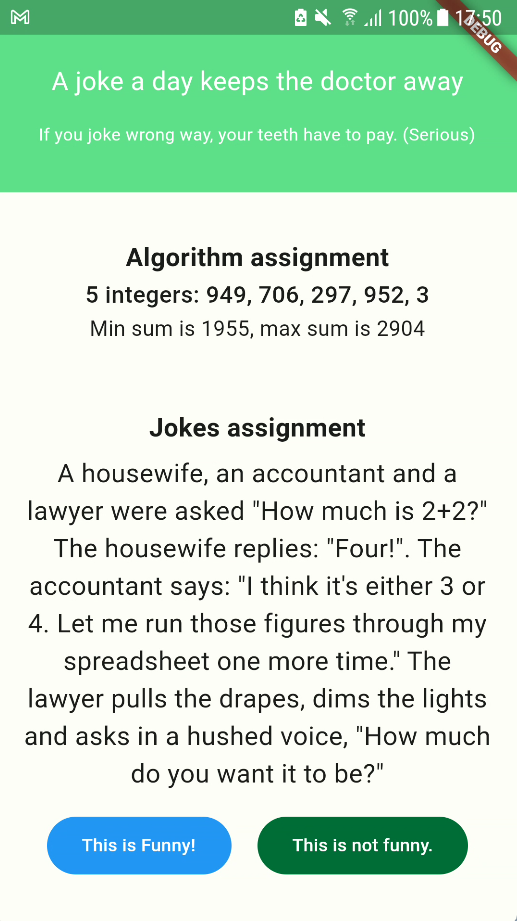

# zens_first_test
A repository which stores the implementation of the requirements in the given intern first test of ZenS
The UI will have 2 main parts:

## Algorithm assignment
1. Display a list of 5 integers and the result of sum min and sum max of 4 of those integers
2. I solved the algorithm assignment by doing:
   - Generate list of 5 integers each time user changes the vote state
   - Sort the list
   - Min sum is the sum of 4 min integers and max sum is the sum of 4 max integer in the sorted list

## Jokes assignment
1. Display a joke and 2 buttons to vote and down-vote for the joke
2. I used BLoC to manage the state of the app

# Product's images:
   - 
   - 