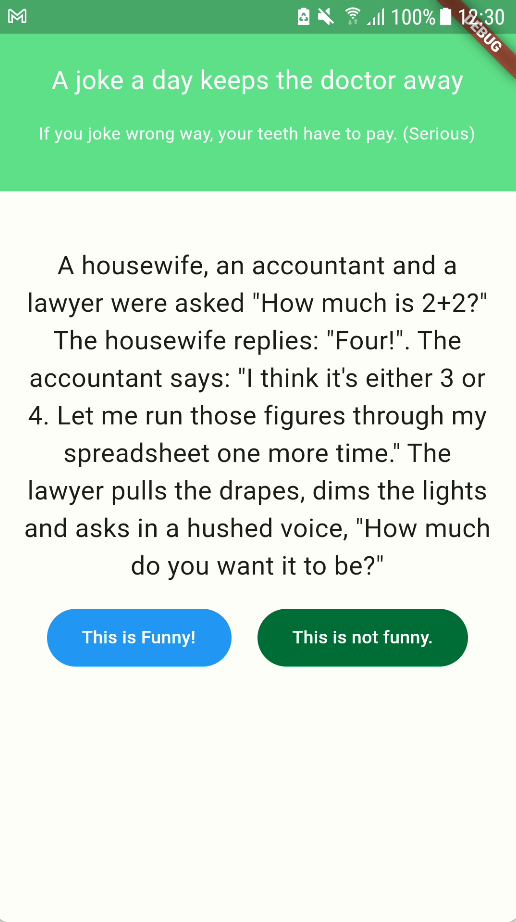
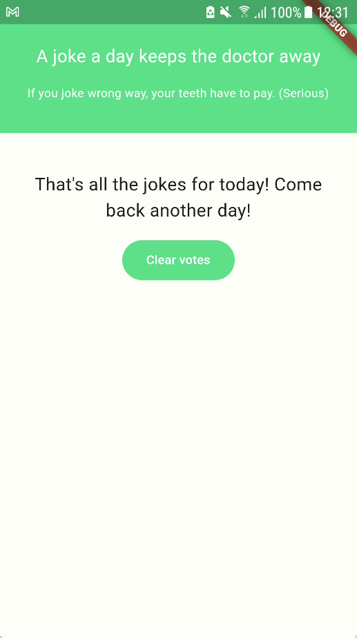

# zens_first_test
A repository which stores the implementation of the requirements in the given intern first test of ZenS
The UI will have 2 main parts:

## Top bar
The green rectangle on the top of the screen with the slogan

## Jokes display
1. Display a joke and 2 buttons to vote and down-vote for the joke
2. Displayed joke is randomly selected from the list of current un-voted available jokes
3. Each time user votes, the joke will be added to voted jokes list and save to local storage
4. If there is no un-voted joke available, the app will show `That's all the jokes for today! Come back another day!` and only 1 button showed, user can use this button to clear local storage to vote again
5. I didn't save the vote result due to the requirement

## Skills used
1. I used BLoC to manage the state of the app
2. I used shared_preferences to store the list of voted jokes

## Structure
The app is small so the tree folder will only contain 4 main parts:
1. blocs: store state manager of the app (I used cubit)
2. constants: store constants like dimensions, colors, strings (storage key and list of jokes)
3. widgets: store widgets used in the app
4. home_page.dart file: the main UI for the app

# Product's images:
   - 
   - 